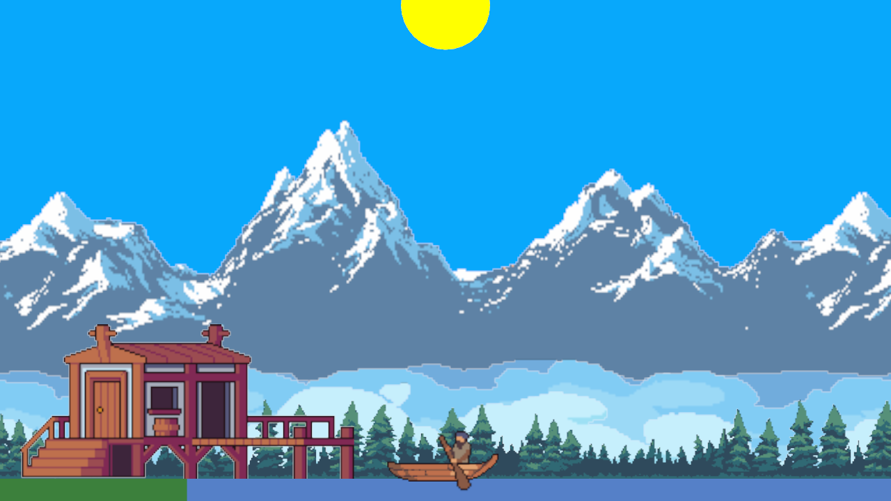

# Bevy Game Project

A 2D fishing game prototype built with the Bevy engine.

_Catch fish, make money, protect the fish population_

The project is mostly an experiment and an attempt to develop a clean multi-layer 2D game architecture on top of ECS, with a clear separation of concerns and the objective of enabling fast scaling with new levels/assets and rapid iteration on new features and mechanics.



## Architecture

The project follows a modular architecture with the core modules including:

- ECS resources
- ECS components
- ECS events
- ECS states
- Layer builder

## Getting Started

### Prerequisites
- Rust (rustc 1.88.0)

### Running the Game
```bash
# Clone and navigate to the project
cd game-project

# Run the game
cargo run

# Or for optimized build
cargo run --release
```

### Controls
- **A**, **D**: Move left/right
- **Space**: Action mode
- **W**, **S**: Hook/Action when in Action mode
- **Tab**: Inventory
- **Esc**: Exit menu/game

## Credits
- Free Fishing Game Assets Pixel Art Pack by https://craftpix.net, license: https://craftpix.net/file-licenses/
- "GLACIAL MOUNTAINS: PARALLAX BACKGROUND" Pixel Art created by Vicente Nitti, license: CC BY 4.0
- "TAIGA ASSETS PACK v2" Pixel Art created by Vicente Nitti, license: CC BY 4.0
